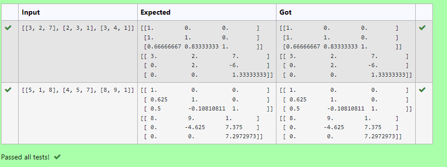

# 5(a) LU Decomposition without zero on the diagonal

## AIM:
To write a program to find the LU Decomposition of a matrix.

## Equipments Required:
1. Hardware – PCs
2. Anaconda – Python 3.7 Installation / Moodle-Code Runner

## Algorithm
1. import numpy as np
2. From scipy package import lu
3. Get input from user
4. Print the result

## Program:
```
/*
Program to find the LU Decomposition of a matrix.
Developed by:KRISHNA PRAKAASH D.M
RegisterNumber:21500183

# To print L and U matrix
import numpy as np
from scipy. linalg import lu 
#import scoipy
#scipy.linalg.lu()
A=np.array(eval(input()))
P, L, U = lu(A)
print(L)
print(U)
*/
```
## Output:



## Result:
Thus the program to find the LU Decomposition of a matrix is written and verified using python programming.


# 5(b) LU Decomposition without zero on the diagonal

## AIM:
To write a program to find the LU Decomposition of a matrix.

## Equipments Required:
1. Hardware – PCs
2. Anaconda – Python 3.7 Installation / Moodle-Code Runner

## Algorithm
1. import numpy as np
2. From scipy package import lu_factor,lu_solve
3. Get input from user
4. Print the result
 
## Program:
```
/*
Program to find the LU Decomposition of a matrix.
Developed by:KRISHNA PRAKAASH D.M
RegisterNumber:21500183


# To print X matrix (solution to the equations)
import numpy as np
from scipy.linalg import lu_factor,lu_solve
A=np.array(eval(input()))
B=np.array(eval(input()))
lu, pivot = lu_factor(A)
x= lu_solve((lu,pivot),B)
print(x)
*/
```
## Output:


## Result:
Thus the program to find the solution  of a matrix is written and verified using python programming.
